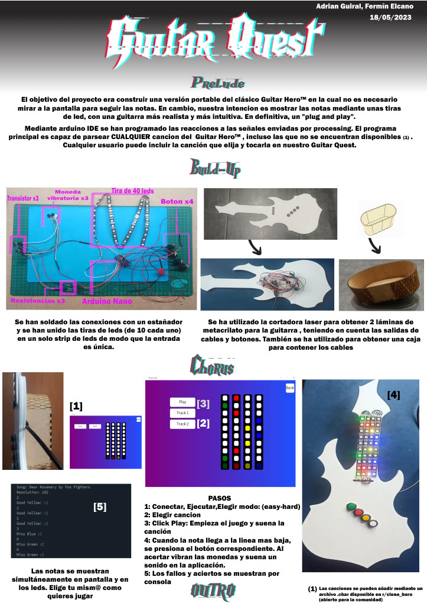

# Guitar_Hero
Proyecto final basado en el desarrollo de una aplicación al estilo Guitar Hero con su controlador único.  
## Poster
Cartel con el proceso de desarrollo del proyecto y funcionalidades del mismo.  

- - - -
Realizado por Fermín Elcano Barbero y Adrián Guiral Mallart.
